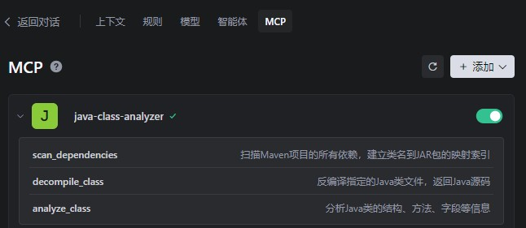
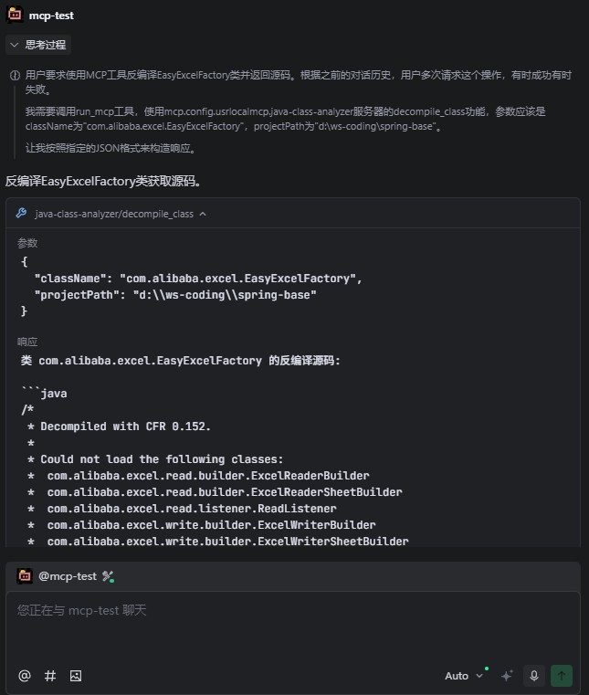

# Java Class Analyzer MCP Server

一个基于Model Context Protocol (MCP)的Java类分析服务，可以扫描Maven项目依赖、反编译Java类文件、获取class方法列表等详细信息，并提供给LLM进行代码分析。

## 适用场景
Cursor等AI工具直接生成调用二方（内部调用）、三方包（外部调用）接口的代码，但因AI无法读取未在当前工程中打开的依赖源码，导致生成的代码错误频出，甚至出现幻觉式编码。

为解决此问题，一般会直接拷贝源码内容喂给LLM；或者先将源码文件放到当前工程内，再在对话中引用。

而使用本地反编译MCP方案最有效，能精准解析jar包中的类与方法，显著提升代码生成的准确性和可用性。

## 功能特性

- 🔍 **依赖扫描**: 自动扫描Maven项目的所有依赖JAR包
- 📦 **类索引**: 建立类全名到JAR包路径的映射索引
- 🔄 **反编译**: 使用CFR工具实时反编译.class文件为Java源码
- 📊 **类分析**: 分析Java类的结构、方法、字段、继承关系等
- 💾 **智能缓存**: 按包名结构缓存反编译结果，支持缓存控制
- 🚀 **自动索引**: 执行分析前自动检查并创建索引
- ⚙️ **灵活配置**: 支持外部指定CFR工具路径
- 🤖 **LLM集成**: 通过MCP协议为LLM提供Java代码分析能力

## 使用示例
### 在IDE中注册mcp服务


### 在智能体对话中使用mcp


## 使用说明

### MCP服务配置
参考[mcp服务配置文件](./mcp-server-config.json)内容，添加到MCP客户端配置文件中。配置示例
```json
{
    "mcpServers": {
        "java-class-analyzer": {
            "command": "node",
            "args": [
                "/path/java-class-analyzer-mcp-server/dist/index.js"
            ],
            "env": {
                "NODE_ENV": "production",
                "MAVEN_REPO": "D:/maven/repository",
                "JAVA_HOME": "C:/Program Files/Java/jdk-11"
            }
        }
    }
}
```

#### 参数说明
- `command`: 运行MCP服务器的命令，这里使用 `node`
- `args`: 传递给Node.js的参数，指向`npm run build`编译后的dist文件夹内文件
- `env`: 环境变量设置

#### 环境变量说明
- `NODE_ENV`: 运行环境标识
  - `production`: 生产环境，减少日志输出，启用性能优化
  - `development`: 开发环境，输出详细调试信息
  - `test`: 测试环境
- `MAVEN_REPO`: Maven本地仓库路径（可选）
  - 如果设置，程序会使用指定的仓库路径扫描JAR包
  - 如果未设置，程序会使用默认的 `~/.m2/repository` 路径
- `JAVA_HOME`: Java安装路径（可选）
  - 如果设置，程序会使用 `${JAVA_HOME}/bin/java` 执行Java命令（用于CFR反编译）
  - 如果未设置，程序会使用PATH中的 `java` 命令
- `CFR_PATH`: CFR反编译工具的路径（可选，程序会自动查找）

### 可用的工具

#### 1. scan_dependencies
扫描Maven项目的所有依赖，建立类名到JAR包的映射索引。

**参数:**
- `projectPath` (string): Maven项目根目录路径
- `forceRefresh` (boolean, 可选): 是否强制刷新索引，默认false

**示例:**
```json
{
  "name": "scan_dependencies",
  "arguments": {
    "projectPath": "/path/to/your/maven/project",
    "forceRefresh": false
  }
}
```

#### 2. decompile_class
反编译指定的Java类文件，返回Java源码。

**参数:**
- `className` (string): 要反编译的Java类全名，如：com.example.QueryBizOrderDO
- `projectPath` (string): Maven项目根目录路径
- `useCache` (boolean, 可选): 是否使用缓存，默认true
- `cfrPath` (string, 可选): CFR反编译工具的jar包路径

**示例:**
```json
{
  "name": "decompile_class",
  "arguments": {
    "className": "com.example.QueryBizOrderDO",
    "projectPath": "/path/to/your/maven/project",
    "useCache": true,
    "cfrPath": "/path/to/cfr-0.152.jar"
  }
}
```

#### 3. analyze_class
分析Java类的结构、方法、字段等信息。

**参数:**
- `className` (string): 要分析的Java类全名
- `projectPath` (string): Maven项目根目录路径

**示例:**
```json
{
  "name": "analyze_class",
  "arguments": {
    "className": "com.example.QueryBizOrderDO",
    "projectPath": "/path/to/your/maven/project",
  }
}
```

### 缓存文件
在当前工程，会生成以下缓存目录和文件。
- `.mcp-class-index.json`: 类索引缓存文件
- `.mcp-decompile-cache/`: 反编译结果缓存目录（按包名结构）
- `.mcp-class-temp/`: 临时文件目录（按包名结构）

## 工作流程

1. **自动索引**: 首次调用`analyze_class`或`decompile_class`时，自动检查并创建索引
2. **智能缓存**: 反编译结果按包名结构缓存，支持缓存控制
3. **分析类**: 使用`analyze_class`或`decompile_class`获取类的详细信息
4. **LLM分析**: 将反编译的源码提供给LLM进行代码分析

## 技术架构

### 核心组件

- **DependencyScanner**: 负责扫描Maven依赖和建立类索引
- **DecompilerService**: 负责反编译.class文件
- **JavaClassAnalyzer**: 负责分析Java类结构
- **MCP Server**: 提供标准化的MCP接口

### 依赖扫描流程

1. 执行`mvn dependency:tree`获取依赖树
2. 解析每个JAR包，提取所有.class文件
3. 建立"类全名 -> JAR包路径"的映射索引
4. 缓存索引到`.mcp-class-index.json`文件

### 反编译流程

1. 根据类名查找对应的JAR包路径
2. 检查缓存，如果存在且启用缓存则直接返回
3. 从JAR包中提取.class文件到`.mcp-class-temp`目录（按包名结构）
4. 使用CFR工具反编译.class文件
5. 保存反编译结果到缓存`.mcp-decompile-cache`目录（按包名结构）
6. 返回Java源码

## 故障排除

### 常见问题

1. **Maven命令失败**
   - 确保Maven已安装并在PATH中
   - 检查项目是否有有效的pom.xml文件

2. **CFR反编译失败**
   - 确保CFR jar包已下载（支持任意版本号）
   - 检查Java环境是否正确配置
   - 可通过`cfrPath`参数指定CFR路径

3. **类未找到**
   - 程序会自动检查并创建索引
   - 检查类名是否正确
   - 确保项目依赖已正确解析

## 测试说明

### 构建项目

```bash
npm install
npm run build
```

### 测试工具使用

项目提供了独立的测试工具，可以直接测试MCP服务的各个功能，无需通过MCP客户端。

```bash
# 测试所有工具
node test-tools.js

# 测试特定工具
node test-tools.js --tool decompile_class --class com.alibaba.excel.EasyExcelFactory --project /path/to/project

# 不使用缓存
node test-tools.js --tool decompile_class --no-cache

# 指定CFR路径
node test-tools.js --tool decompile_class --cfr-path /path/to/cfr.jar
```

### 测试工具参数

- `-t, --tool <工具名>`: 指定要测试的工具 (scan|decompile|analyze|all)
- `-p, --project <路径>`: 项目路径
- `-c, --class <类名>`: 要分析的类名
- `--no-refresh`: 不强制刷新依赖索引
- `--no-cache`: 不使用反编译缓存
- `--cfr-path <路径>`: 指定CFR反编译工具的jar包路径
- `-h, --help`: 显示帮助信息

### 日志级别控制

通过 `NODE_ENV` 环境变量控制日志输出：

- `development`: 输出详细调试信息
- `production`: 只输出关键信息
